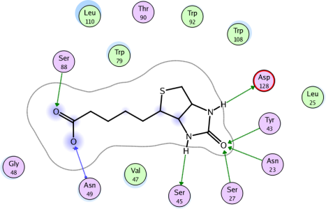
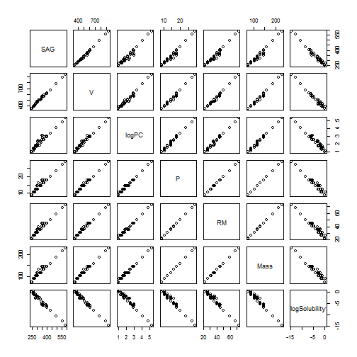
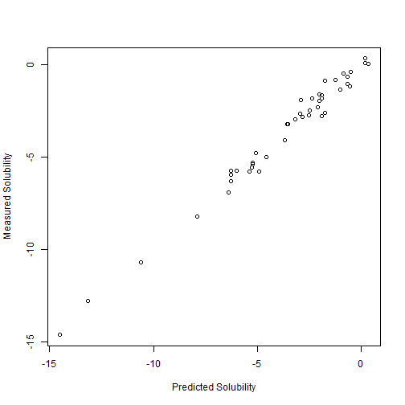

<!-- Limit image width and height -->


## Slide 1

In the pharmaceutical Industry, the field of study devoted to predicting properties based on the atomic makeup of the molecules is called CHEMINFORMATICS.



--- .class #id 

## Slide 2

Test 2

In this presentation, we will demonstate the predictive power applied to Cheminformatics.
Our Shiny app shows how the solubility of certain alcohols can be predicted by their properties.
Given three differnt alcohols, we model their predicted solubility in water versus their measured solubility

---

<style type='text/css'>
img {
    max-height: 560px;
    max-width: 964px;
}
</style>

## Slide 3


Some exploratory modelling demonstates that a simple linear regression model pretty accurately predicts the solubility of the alcohol.
Below is the relationship between solubility and surface area


---

<style type='text/css'>
img {
    max-height: 400px;
    max-width: 964px;
}
</style>

## Slide 4
In fact we can see that overall the linear relationships between all of the parameters is highly correlative...
 
 

```r
pairs(alcohol)
```



---

## Slide 5
 
However, some of these relationships may break down at higher values
Therefore, we will construct a multivariate regression model that we can use to predict solubility values over a range of values, and will give high confidence in its predictive power. Below is a plot of the predicted solubility versus the measured. Still pretty good.


